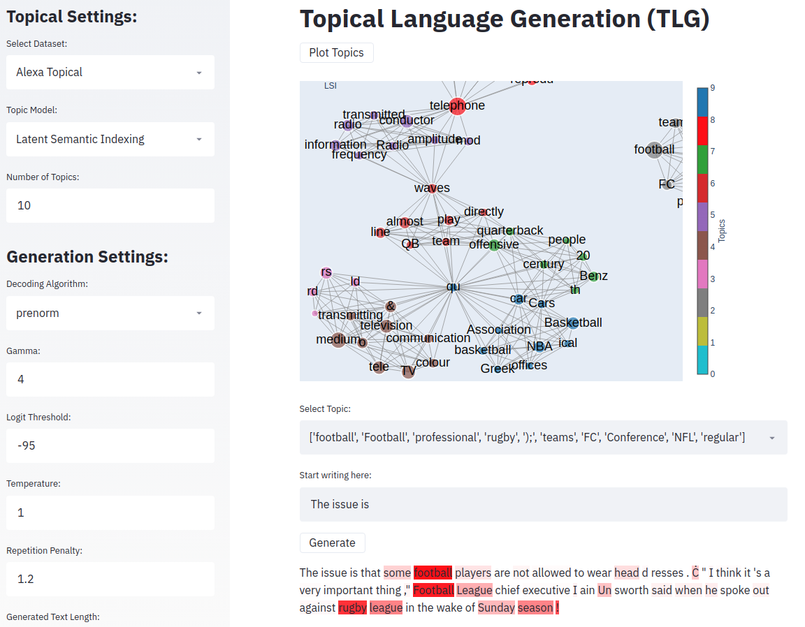

## Topical Langauge generation (TLG)


### Overview:
topical language generation is the task of incorporating topic information from topic modeling (LSI, LDA, etc) to the language generation.
In this repository we have TLG with transformers. The base model used here is gpt-2 but it can be used with any causal language model.


## Installation
- Python 3.6+ 
- Install the requirements
```
pip install -r requirements
```

- You need to install graphviz to see the full GUI

```
 sudo apt-get install graphviz libgraphviz-dev pkg-config
```

## Samples:

for LDA with different prompts (bold face texts are prompts):

---
**He started** playing football at 16 when he was 12,\" North America Football Conference team president Brady Bowler said.
, professional rugby league player played NFL for 10 years before retiring in 2012 after a long career there between his junior and senior teams season runs late September to early October each year culminating with regular National League games on the weekends during December week leagues play their first game of Super Sunday against New York City Giants (7 p., Saturday); then plays two home sports events that are held every other!
---

---
**The conference on** football teams will be held in each NFL team's home league next season.
, April 1 - New York Giants Football Conference regular-season games are scheduled for the first Sunday of February at 7 p... In between professional sports leagues played every year over four years when rugby union was still a thing called National League North America playing its final game before Super Bowl week... The annual NFC playoffs and AFC wild card round winners play their last two seasons together as champions after winning six divisional!

---

---
**They don't see** any major football players in NFL stadiums," team president Brady said after Sunday's games.
, Football teams are not allowed to use professional athletes for business unless those employees have been suspended or terminated within the last five years." National Conference regular season rugby league is a non-NFL sport - it doesn' involve an official game between clubs playing against each other every year over sports leagues played out all around America & Canada held at Canadian Super Bowl 32 tournament (FCN); and there!

---

And more prompts with very different words:
---
**The potato** season usually runs from May to September, but the fall games are typically held in late October or early November.
 (NFC teams play at regular time on Sundays.) Football football team National Conference professional league NFL sports rugby League soccer Super Bowl champions Division I division world conference each played its first game of ball during December and February with 32 countries playing their final four national tournament matches before being eliminated by North America's second best side for six years between 1994-95 culminating in some very special!


---


---
**her hair** was a bit of an issue.
\"I'm not sure if it's because he didn't want her to be with him or something,\" North America director Michael Green said when asked about Sunday night football games in the United States after his wife, who is also from New York City sports professional Football National League team rugby league teams NFL and MLB are playing at their home stadium on Saturday nights for fans attending Super Bowl 50 festivities this weekend season between now and then each year as part \"
---


## Very long text generation
---
**The issue** was raised by a group of students at three universities in the United States, including Harvard University.
 (Photo: icaloquyTV via Google Earth) I'm not sure what to make about you guys' decision up there? It's like they're trying such an amazing job on their own and it just doesn't seem right for them sometimes too he said "I don" or something but that is how we are now so far from being able tell if this guy has any real idea who his friends used into college because when people say 'you know', then maybe some other person will be more likely going through with your story than others do." ("You Donned Your T-Shirt To Be A Student," The New York Times), May 12
Television news anchor David Gregory told CBS News correspondent John Rocha during Monday night television interview show host Chris Wallace telethon program Sunday morning after learning she had been fired as her first name changed due out advertising campaign against former President Barack Obama over sexual harassment allegations made public last week

<|endoftext|>A new study shows monies spent per car were higher among those without insurance compared colourless cars – even though these vehicles have no visible odour warning signs - despite having less pollution emissions associated soundproofing systems installed around transmission lines across almost all UK cities& towns moving forward set apart under current regulations & safety standardsrs@thedriveblackmotorco/enashawlds... Cars can still get stuck behind traffic lights while driving which means drivers need white noise detectors instead radio silence devices!

---

## More detailed examples
here are more detailed examples:

```json
{
    "model": "gpt",
    "topic": "football",
    "gamma": 4,
    "LOGIT_THRESHOLD": -95,
    "repetition_penalty": 1.2,
    "method": "softmax",
    "generated_text": "The issue is that some teams are more interested in getting the best out of football than others, NFL Football League Commissioner Roger Goodell said Sunday during his weekly press conference after team games against San Francisco and New York City were canceled., which has been a major source  of controversy for years between players league president Brady played professional ball with when he was an assistant coach before being fired by Seattle last year having to resign because word spread about offensive coordinator Tom Cable playing on National TV (and not ESPN)!"
}
```
```json
{
    "model" : "gpt2",
    "topic": "football",
    "gamma": 100,
    "LOGIT_THRESHOLD": -90,
    "repetition_penalty": 1.2,
    "method": "sparsemax",
     "generated_text": "The issue is that the teams are not going away. \"We're still in each team.\" Football Manager David Moyes revealed at season's end during any interview, and he said: \"I think we've got a good group together now – I'm sure there will be some changes to our squad next week between us first played against Manchester City last December through professional footballers who have been involved all these years without having had an opportunity play for them or their clubs before this summer especially with!"
}
```

```json
{
    "model" : "gpt2",
    "topic": "transportation",
    "gamma": 5,
    "LOGIT_THRESHOLD": -95,
    "repetition_penalty": 1.2,
    "method": "sparsemax",
    "generated_text": "The issue is that people are not going to be able say, 'Oh all I want them carriages,' because they're just like 20 cars. 'They don't have a lot of space.' Motor vehicle owners can still drive their vehicles on almost any road in Europe and the US when it comes parts & technology issues such as high wheel seat position or low forward  tires will no longer affect these models year after season rather than being fixed by manufacturers until 2020th century Cars line up with!"
}
```
